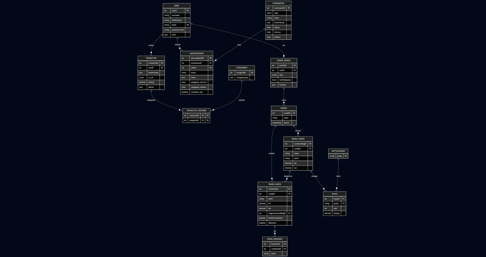

# Dossier

## 📋 Studentgegevens

- **Student:** Aykon Kirhan
- **Studentennummer:** 202405274
- **E-mailadres:** <aykon.kirhan@student.hogent.be>
- **Student:** Jasper Huyghe
- **Studentennummer:** 202405272
- **E-mailadres:** <jasper.huyghe@student.hogent.be>
- **Telefoonnummer:** +324 99 91 24 05 / +324 94 67 00 49

- **GitHub repository:** <https://github.com/HOGENT-frontendweb/frontendweb-2526-kirhanhuyghe>
- **Online versies:**
  - **Back-end:** <https://frontendweb-2526-kirhanhuyghe-backend.onrender.com/>
  - **Front-end:** <https://portaal.kljsgw.be/>
- **Demo:** <LINK_NAAR_DEMO_VIDEO>

## 🔐 Logingegevens

> LOGIN ALS ADMIN:
> <jasper.huyghe@outlook.be> | hashed_pw_123
>
> LOGIN ALS USER:
> <aykon.kirhan@kljsgw.be> | v
>
> LOGIN ALS HOOFDLEIDING:
> <lander.leeman@kljsgw.be> | landerleeman
>
> LOGIN ALS GROEPSVERANTWOORDELIJKE:
> <robbe.braem@kljsgw.be> | robbebraem

## 🧐 Testen van onze applicatie

- Email exports testen
*Voor mevrouw Samyn en meneer De Witte maakte ik al logingegevens aan. Jullie kunnen stap 2 tot 4 skippen: (<karine.samyn@hogent.be> | karinesamyn of <andreas.dewitte@hogent.be> || andreasdewitte)*
  - 1. Ik mailde u de .env gegevens door om de nodemailer te doen werken, maak een .env file in de backend en kopieer deze hierin.
  - 2. Log in als uzelf jasper huyghe (<jasper.huyghe@outlook.be> | hashed_pw_123)
  - 3. Maak een gebruiker aan (../register) waar je uw emailadres gebruikt en een wachtwoord van minimum 8 tekens
  - 4. Klik op "beheer gebruikers" en maak nieuwe testaccount admin, save en sluit
  - 5. Klik bij transacties op 'PDF rapport'
  - 6. Als alles goed loopt, is deze binnen de minuut zeker bezorgd. Check zeker de spamfolder!

- Ronde maken/transacties csv import testen
  - Onder Docs/testbestanden zit de csv bestanden die hier nodig zijn.

1. Importeer het bestand voor leden bij leden
2. Importeer het bestand voor leiding bij leiding
3. Klik op de knop (het is normaal dat de verwerking even duurt.)

Opmerking: op het transactiescherm, klik zeker nog eens op de headers om de sorting te testen!

### Lokale omgeving

ZIE HIERBOVEN + IN DE INSTRUCTIES

## 📖 Projectbeschrijving

> **Instructie:** Beschrijf hier duidelijk en beknopt waarover jouw project gaat. Wat is het doel? Wie is de doelgroep? Welke functionaliteiten biedt het?

Het KLJ portaal biedt verschillende oplossingen en automatisaties voor problemen waar KLJ afdelingen en soortgelijke verenigingen dagelijks mee te maken krijgen. Hieronder vindt u een lijst van functionaliteiten

Functionaliteiten:
login
  inloggen
  login aanvragen (omdat de doelgroep van onze applicatie is dat alleen een kleine groep mensen (leiding) de info mag zien, worden logins manueel aangevraagd en aangemaakt door de admlin. Wanneer iemand een login aanvraagt, voert hij/zij deze gegevens in en krijgt de admin hier een mail van.)

Transacties
  het manueel toevoegen of aanpassen van transacties
  het importeren van transacties uit een csv
  het sorteren van de tabel op datum
  een PDF laten genereren en doorsturen op basis van de transacties gesorteerd op de categorieën

Categorieën
  Het kiezen van een categorie
  Een overzicht via grafieken over alle categorieën
  een tabel overzicht per categorie wat er IN en UIT is gegaan.
  een paar nuttige grafieken per categorie
  een knop om categorieen aan te maken/verwijderen

Leiding
  een overzicht van alle leiding
  leiding verwijderen, wijzigen of toevoegen (alleen admins)

Aanwezigheden
  Een lijst van aankomende evenementen, activiteiten, vergaderingen
  Een knop om aan te geven of je aanwezigheid toe te voegen
  Evenementen toevoegen, wijzigen of verwijderen (alleen admins of hoofdleiding of groepsverantwoordelijke)
  De lijst van aanwezigheden bekijken
  De mogelijkheid om aanwezigheden als PDF door te mailen (alleen admins of hoofdleiding of groepsverantwoordelijke)
  Als een leiding 7 dagen voordat een evenement begint nog geen antwoord heeft gegeven krijgt deze een reminder toegestuurd per mail
  Als een leiding 4 dagen op voorhand nog steeds geen antwoord heeft krijgt de hoofdleiding hier een mail van.
  Als er te weinig mankracht is voor een activiteit krijgen de groepsverantwoordelijke hier een mail van zodat ze kunnen schuiven met de leiding die wél kan.

Ronde maken
  *Elk jaar gaat bij de inschrijving elke leiding rond bij de leden om uitleg te geven en de leden in te schrijven, nu kijkt iemand manueel welke huizen het dichtst bij elk huis liggen, deze tool automatiuseert dit*
  Een ronde een naam geven, data importeren (ledenlijst en leidinglijst) zodat een algoritme de kortste afstand berekent tot elk huis.
  Hierna toont hij een overzicht van elke leiding en zijn/haar huizen dat hij/zij moet doen. Onder elk adres staat welke leden dit zijn en er is een link naar het adres via Google Maps

Kasjes
  *Elke leeftijdsgroep heeft jaarlijks een budget om op te doen. Om redundante toevoegingen te voorkomen wordt deze in het systeem gezet door als categorie een leeftijdsgroep in te geven.*
  Jaarbudget aanpassen (Alleen admin/hoofdleiding)
  Bekijken van budget per leeftijdsgroep en een overzicht van de recente transacties

Profielpagina
  Wachtwoord veranderen
  Users hun roles aanpassen (alleen admin)

Loguit
  Simpele logout pagina met knop om terug te gaan

Gebruiker toevoegen (alleen admin)
  Alleen een admin kan via hier een gebruiker toevoegen.

## 🌳 ERD

#### 1. Kasboekhouding (Transacties & Categorieën)

Transacties zijn geld die in of uit gaat: inkomsten en uitgaven. Om dit georganiseerd te houden, kun je elke transactie in één of meer categorieën plaatsen (bijvoorbeeld "snacks", "materiaal", "vervoer"). De tabel Transactie_Categorie verbindt deze twee: één transactie kan in meerdere categorieën zitten, en één categorie kan veel transacties hebben.

#### 2. Evenementen & Aanwezigheid

Evenementen zijn dingen die gebeuren: activiteiten, vergaderingen, uitstappen, enzovoort. Ze hebben een datum, tijd en beschrijving.
Voor elk evenement houd je bij wie aanwezig is via Aanwezigheid. Dit is een koppeling tussen een User en een Evenement: je ziet wie er was, wie niet, en waarom (met optionele aangepaste tijden als iemand later kwam of eerder wegging).

#### 3. Ronde-Verdeling

Per ronde heb je:

Ronde_Leiding: Dit zijn de mensen die deze ronde gaan lopen. Ze hebben een naam, adres (hun startpunt) en coördinaten.
Ronde_Huizen: Dit zijn alle huizen/adressen in die wijk met hun coördinaten.
Ronde_Bewoners: Dit zijn de namen van de mensen in elk huis.

Je algoritme berekent dan de optimale verdeling: welke huizen krijgt welke ronde-leiding toegewezen op basis van afstand.

#### 4. Kasjes (Groepsbudgetten)

Kasjes houden per leeftijdsgroep (zoals "-8", "-12", "+16") en per jaar bij hoeveel geld beschikbaar is. Dit is een centrale plek waar je ziet hoeveel budget elke leeftijdsgroep heeft.

#### 5. Hoe alles samenkomt

Users zijn het middelpunt: zij maken transacties aan, zij worden ingedeeld in rondes, zij worden geregistreerd voor evenementen.
Leiding_Profiel geeft extra info over elke user: hun telefoonnummer, welke leeftijdsgroep ze begeleiden, en wat hun beschrijvende functies zijn.
Rondes zijn tijdelijk: je maakt er een aan, voert huizen in, het algoritme verdeelt alles, en je bent klaar.
Kasjes zijn permanent: je stelt ze in per jaar, en ze tonen het budget dat beschikbaar is.

## ✅ Ontvankelijkheidscriteria

- [x] Het project van Web Services voldoet aan **alle** ontvankelijkheidscriteria zoals beschreven in de rubrics.
- [x] Het project van Front-end Web Development voldoet aan **alle** ontvankelijkheidscriteria zoals beschreven in de rubrics.

## 🚀 Extra technologieën

### Front-end Web Development

- <https://mui.com/material-ui/>
  - Een visuele upgrade voor onze applicatie
  - Het gebrui van een avatar
  - Het gerbruik van een datepicker
  - Het gebruiken van icoontjes & het loading icoontje
  - custom forms aanmaken
  - custom dialog boxes

- <https://www.npmjs.com/package/dayjs>
  - Dependency van de MUI Datepicker om met datums te werken

- <https://tanstack.com/table/latest>
  - De lector gaf de opmerking dat onze tabel te veel leek op degene in de voorbeeldapplicatie. De synax om een tanstack table op te zetten verschilt van de native React syntax.
  - Door tanstack te gebruiken konden we makkelijk een sorteerfunctie toevoegen

- <https://www.npmjs.com/package/chart.js?activeTab=readme>
  - Het visualiseren van zowel de kasjes als de categorieën

- <https://react-chartjs-2.js.org/>
  - Extra componenten voor chartjs

- <https://www.npmjs.com/package/framer-motion>
  - Een visuele upgrade voor onze applicatie, zowel het laden van de pagina als het tonen van de grafieken
- <https://www.npmjs.com/package/react-csv-importer>
  - Importeren van csv bestanden mogelijk maken gebruikt voor transacties & de rondes

- <https://www.npmjs.com/package/papaparse>
  - Dependency van react-csv-importer

### Web Services

- <https://www.npmjs.com/package/@faker-js/faker>
  - Dit w 1 van de voorgestelde extra's
  - Handig om veel data in het project te krijgen

- <https://nodemailer.com/>
  - We moesten een manier hebben om de pdf op te sturen
  - We moesten een manier hebben voor een gebruiker om een aanvraag in te dienen
  - We moesten een manier hebben om reminders te sturen naar leiding. Whatsapp APIs of SMS zijn betalend.

- <https://www.npmjs.com/package/pdfkit>
  - Makkelijke manier om een rapport op te maken om te delen tijdens een vergadering

## 🤔 Reflectie

### Aykon

**Wat heb je geleerd?**

Tijdens het maken van het project heb ik heel wat nieuwe technologieën ontdekt. Ik vond dit een heel leerrijke ervaring, omdat we niet enkel dingen uit de les hebben overgenomen, maar ook zelf zoveel technologieën en libraries mochten toevoegen. Ik vond het tof dat we heel vrij waren om alles te gebruiken om zo een mooie. functionele applicatie te ontwikkelen.
Ik heb vooral bijgeleerd dat er enorm veel mogelijkheden zijn binnen de IT-wereld aan de hand van libraries. Ook vind ik het heel handig dat we nu ook al een goede kennis qua pnpm-commandos hebben opgedaan.

**Wat vond je goed aan dit project?**

Ik heb mezelf verbaasd met wat we hebben bereikt en had nooit gedacht dat ons project zo uitgebreid en professioneel zou zijn. De UI en UX vind ik heel gebruiksvriendelijk en ik vind dat we zeer mooie code hebben geschreven.

**Wat zou je anders doen?**

Ik zou eerste een beter plan opstellen met alle functies en pagina's dat we nodig hebben voor ons project en dan pas te beginnen ontwerpen en programmeren.

**Wat waren de grootste uitdagingen?**

De hoeveelheid keer dat een bepaalde pagina of functie niet meer werkte na het toevoegen van nieuwe code was enorm en hier hebben we dus ook heel veel tijd in moeten steken. Een voorbeeld hiervan zijn de cypress-testen. Ze werkten allemaal perfect en dan een week later werkte nog maar de helft.

**Wat zou je behouden aan de cursus?**

Ik vind dat zowel de cursus Front-end Web Development als Web Services goed is opgebouwd aan de hand van een handige inhoudstafel en dat de commandos ook zeer duidelijk zijn opgemaakt.

**Wat zou je toevoegen/aanpassen?**

Grote blokken uitleg opdelen in kleinere stukjes met voorbeelden ertussen. Soms is het wat moeilijk om te onthouden wat je net hebt gelezen als je ondertussen al aan de volgende alinea zit die over iets anders gaat.

### Jasper

**Wat heb je geleerd?**

Doorheen het project heb ik heel veel bijgeleerd. Hoe routing werkt, hoe de beveiliging werkt, ...
Mijn belangrijkste leerproces vond ik dat er heel veel libraries gebruikt die je als een soort puzzelstukjes allemaal kunt implementeren om je applicatie naar een hoger niveau te tillen.

**Wat vond je goed aan dit project?**

Ik vind dat onze applicatie heel modern en professioneel oogt. Qua backend denk ik dat we een paar knappe algoritmes hebben uitgeschreven.

**Wat zou je anders doen?**

Ik zou vanaf het begin meer kijken naar 'het grote plaatje' in plaats van heel hard te focussen op één functie.

**Wat waren de grootste uitdagingen?**

De bestandsindeling die KBC geeft wanneer je via KBC Touch een csv aanvraagt, is verschrikkelijk opgebouwd. Zorgen dat de applicatie deze zonder conversies kan lezen was ongetwijfeld mijn grootste uitdaging.

**Wat zou je behouden aan de cursus?**

De opbouw en de voorgekauwde code vind ik top!

**Wat zou je toevoegen/aanpassen?**

Minder grote blokken tekst, dit is iets waar je snel overleest. Ik denk dat het nuttiger zou zijn als de code gedocumenteerd was met comments in plaats van pijltjes.

### Reflectie groepswerk

**Hoe verliep het groepswerk?**
Aykon en ik werken al samen aan groepswerken sinds het zesde middelbaar, ik durf te zeggen dat wij heel goed op elkaar zijn ingespeeld en elkaars tekortkomingen kunnen opvullen.

> **Instructie:** Vink voor elk groepslid één van de drie opties aan door een 'x' tussen de vierkante haken te plaatsen: `[x]`

- **Jasper:**

  - [ ] Ik heb minder bijgedragen dan mijn groepsgenoot
  - [x] Ik heb evenveel bijgedragen als mijn groepsgenoot
  - [ ] Ik heb meer bijgedragen dan mijn groepsgenoot

Hoewel ik het meeste commits en lijnen code heb denk ik dat onze bijdrage wel ongeveer 50/50 is. Veel complexe problemen, ideeën en designs werkte we samen achter de schermen uit.

- **Aykon:**
  - [ ] Ik heb minder bijgedragen dan mijn groepsgenoot
  - [x] Ik heb evenveel bijgedragen als mijn groepsgenoot
  - [ ] Ik heb meer bijgedragen dan mijn groepsgenoot

> **Instructie:** Geef per persoon een duidelijk overzicht van wat die heeft geïmplementeerd voor het project voor het olod Web Services.

| Functionaliteit | Jasper | Aykon | Beide |
|------------------|--------|-------|-------|
| **Login / authenticatie** | ✅ (JWT, guards, decorators, login/register endpoints) | ✅ (login bugfix) | |
| **Transacties** | | | |
| - CRUD + validatie | ✅ (transactieservice, DTOs, controllers) | ✅ (async refactoring, getById, updateById) | |
| - CSV-import logica | ✅ | ✅ (KBC format ondersteuning) | ✅ |
| - Dubbele transactie check | ✅ | | |
| **Categorieën** | | | |
| - CRUD + join-tabel met transacties | ✅ (schema, service, endpoints) | ✅ (categoriekeuze, join-tabel logica) | ✅ |
| - Categorie toevoegen via DB | ✅ | ✅ | |
| **Gebruikers & rollen** | ✅ (rol-based access, role guards, user service, DTOs) | ✅ (gebruikersdata ophalen, Swagger docs) | ✅ |
| **Kasjes / Budgets** | ✅ (DB schema, seeding, API endpoints) | | |
| **Mailfunctionaliteit** | ✅ (nodemailer voor wachtwoordherstel & rapporten) | | |
| **Logging & error handling** | ✅ (global filters, Drizzle error handling) | | |
| **Database & ORM** | ✅ (Drizzle, MySQL, docker-compose, migrations) | | |
| **Registratie** | ✅ (wachtwoord hashing, default role) | | |
| **Email reminders** | ✅ | | |
| **PDF exports** | ✅ | ✅| ✅|
| **CI/CD** | ✅  | | |
| **Testing** |   | ✅| |

**Welke functionaliteiten heeft elk groepslid toegevoegd voor Front-end Web Development?**

 Functionaliteit | Jasper | Aykon | Beide |
|------------------|--------|-------|-------|
| **Login / authenticatie** | ✅ (auth context, login pagina, JWT, logout) | ✅ (fix login bug, logout bij token vervallen) | ✅ |
| **Transacties** | | | |
| - Manueel toevoegen/aanpassen | ✅ (dialog, forms) | ✅ (edit-popup volledig werkend) | ✅ |
| - CSV-import | ✅ (import logica, vertaling) | ✅ (CSV-fix, import werkt volledig) | ✅ |
| - Sorteren op datum | | ✅ | |
| - PDF genereren & mailen | ✅ (rapport opmaak + mail) | | |
| **Categorieën** | | | |
| - Categorie kiezen bij transactie | ✅ | ✅ (dropdown gefixt, categorie-ID mapping) | ✅ |
| - Tabel overzicht per categorie (IN/UIT) | | ✅ (onnodige kolommen verwijderd) | |
| - Categorie toevoegen/verwijderen | ✅ (frontend integratie) | | |
| **Leiding** | | | |
| - Overzicht en CRUD (alleen admin) | ✅ (leidingspagina + knop alleen voor admins) | | |
| **Aanwezigheden** | | | |
| - Lijst evenementen + aanwezigheid aanduiden | ✅ (frontend OK) | | |
| - Evenementen beheren (alleen bevoegden) | ✅ | | |
| **Kasjes / Budgets** | ✅ (volledige UI + doughnut chart) | | |
| **Profielpagina** | ✅ (wachtwoord wijzigen, rollen UI) | | |
| **Layout & UX** | | | |
| - Responsiveness | ✅ | ✅ (verbeterde layout, hamburgermenu, overflow) | ✅ |
| - Dark mode (later verwijderd) | ✅ | ✅ | |
| - Routing / navigatie | ✅ | ✅ (React Router, links, navbar) | |
| **Gebruiker toevoegen** | ✅ (knop alleen zichtbaar voor admins) | | |
| **CI/CD** | ✅  | | |
| **Testing** |   | ✅| |

---
